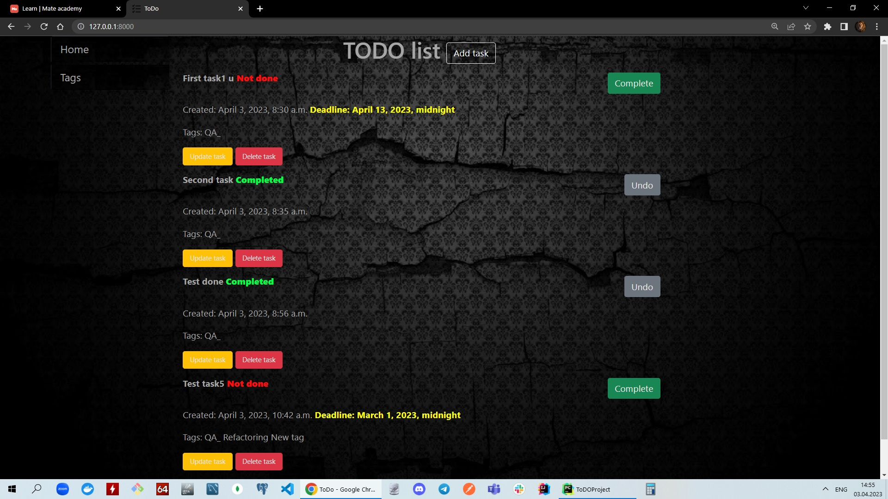

# TODO


## Installing / Getting started

`Python3 must be already installed`

```shell
git clone https://github.com/AndereLion/Trello_analog
cd ToDOProject
python -m venv venv
venv\Scripts\activate (on Windows)
source venv/bin/activate (on macOS)
pip install -r  requirements.txt
python manage.py migrate
python manage.py runserver

```

### Demo

